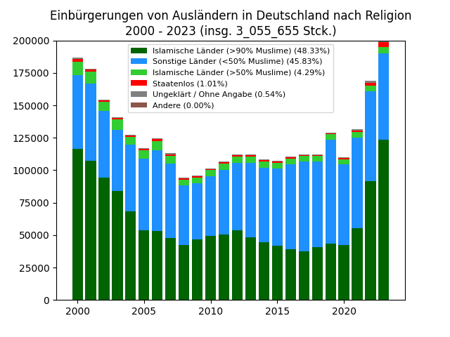

# Einbürgerungs-Statistik Deutschland 2000-2023


Nach Religion:  


```
Insgesamt gab es von 2000-2023 3_055_655 Einbürgerungen.
Länder nach Gesamtzahl der Einbürgerungen 2000-2023:
Türkei: 739_532 (24.20%)
Syrien: 182_901 (5.99%)
Polen: 120_769 (3.95%)
Iran, Islamische Republik: 119_747 (3.92%)
Irak: 97_601 (3.19%)
Ukraine: 86_366 (2.83%)
Afghanistan: 83_201 (2.72%)
Rumänien: 80_847 (2.65%)
Marokko: 73_287 (2.40%)
Russische Föderation: 72_040 (2.36%)
Italien: 61_513 (2.01%)
Griechenland: 57_300 (1.88%)
Kosovo: 50_856 (1.66%)
Vereinigtes Königreich: 49_815 (1.63%)
Israel: 47_874 (1.57%)
Kroatien: 47_803 (1.56%)
Libanon: 46_208 (1.51%)
Vietnam: 46_180 (1.51%)
Bosnien und Herzegowina: 45_660 (1.49%)
Kasachstan: 40_032 (1.31%)
Serbien: 37_676 (1.23%)
Pakistan: 37_307 (1.22%)
Jugoslawien, Bundesrep. (27.04.1992-04.02.2003): 35_259 (1.15%)
Indien: 34_160 (1.12%)
Sri Lanka: 33_436 (1.09%)
Bulgarien: 31_759 (1.04%)
Staatenlos: 30_824 (1.01%)
Tunesien: 26_641 (0.87%)
China: 25_835 (0.85%)
Serbien und Montenegro (05.02.2003-02.06.2006): 23_714 (0.78%)
Brasilien: 22_145 (0.72%)
Ungarn: 21_623 (0.71%)
Nordmazedonien: 21_208 (0.69%)
Vereinigte Staaten: 20_579 (0.67%)
Nigeria: 20_377 (0.67%)
Serbien (einschl. Kosovo) (03.06.2006-16.02.2008): 18_609 (0.61%)
Ghana: 17_064 (0.56%)
Kamerun: 16_532 (0.54%)
Ungeklärt / Ohne Angabe: 16_354 (0.54%)
Thailand: 15_597 (0.51%)
Philippinen: 15_526 (0.51%)
Spanien: 15_163 (0.50%)
Ägypten: 14_319 (0.47%)
Frankreich: 13_200 (0.43%)
Portugal: 11_676 (0.38%)
Tschechien: 11_073 (0.36%)
Algerien: 11_016 (0.36%)
Niederlande: 10_788 (0.35%)
Togo: 9_915 (0.32%)
Albanien: 9_868 (0.32%)
Eritrea: 9_623 (0.31%)
Äthiopien: 9_423 (0.31%)
Mexiko: 9_080 (0.30%)
Moldau, Republik: 8_698 (0.28%)
Belarus: 8_483 (0.28%)
Kongo, Demokratische Republik: 8_100 (0.27%)
Jordanien: 7_787 (0.25%)
Kolumbien: 7_464 (0.24%)
Georgien: 7_350 (0.24%)
Kuba: 7_319 (0.24%)
Slowakei: 7_127 (0.23%)
Kirgisistan: 6_979 (0.23%)
Armenien: 6_870 (0.22%)
Österreich: 6_708 (0.22%)
Aserbaidschan: 6_619 (0.22%)
Litauen: 6_322 (0.21%)
Kenia: 6_285 (0.21%)
Peru: 6_024 (0.20%)
Somalia: 5_970 (0.20%)
Usbekistan: 5_661 (0.19%)
Lettland: 5_605 (0.18%)
Dominikanische Republik: 5_494 (0.18%)
Argentinien: 5_426 (0.18%)
Bangladesch: 5_003 (0.16%)
Schweiz: 4_783 (0.16%)
Angola: 4_767 (0.16%)
Korea, Republik: 4_571 (0.15%)
Ecuador: 4_445 (0.15%)
Slowenien: 4_285 (0.14%)
Venezuela, Bolivarische Republik: 3_528 (0.12%)
Libyen: 3_520 (0.12%)
Jemen: 3_489 (0.11%)
Südafrika: 3_209 (0.11%)
Kongo, Republik: 3_149 (0.10%)
Indonesien: 3_009 (0.10%)
Chile: 2_982 (0.10%)
Cote d'Ivoire: 2_744 (0.09%)
Belgien: 2_687 (0.09%)
Guinea: 2_652 (0.09%)
Montenegro (ab 03.06.2006): 2_631 (0.09%)
Gambia: 2_073 (0.07%)
Schweden: 2_030 (0.07%)
Finnland: 1_985 (0.06%)
Sudan (einschließlich Südsudan) (bis 08.07.2011): 1_974 (0.06%)
Nepal: 1_953 (0.06%)
Sierra Leone: 1_764 (0.06%)
Senegal: 1_670 (0.05%)
Bolivien, Plurinationaler Staat: 1_668 (0.05%)
Australien: 1_640 (0.05%)
Palästinensische Gebiete: 1_618 (0.05%)
Estland: 1_588 (0.05%)
Dänemark: 1_274 (0.04%)
Kanada: 1_200 (0.04%)
Uganda: 1_188 (0.04%)
Taiwan: 1_177 (0.04%)
Benin: 1_096 (0.04%)
Turkmenistan: 1_040 (0.03%)
Mongolei: 992 (0.03%)
Kambodscha: 978 (0.03%)
Mosambik: 894 (0.03%)
Irland: 889 (0.03%)
Tadschikistan: 854 (0.03%)
Sudan (ohne Südsudan) (ab 09.07.2011): 816 (0.03%)
Burkina Faso: 809 (0.03%)
Myanmar: 792 (0.03%)
Guatemala: 748 (0.02%)
Costa Rica: 741 (0.02%)
Korea, Demokratische Volksrepublik: 734 (0.02%)
Ruanda: 719 (0.02%)
Liberia: 678 (0.02%)
Simbabwe: 673 (0.02%)
Malaysia: 662 (0.02%)
Nicaragua: 647 (0.02%)
Uruguay: 639 (0.02%)
Jamaika: 623 (0.02%)
Honduras: 593 (0.02%)
Japan: 591 (0.02%)
Luxemburg: 569 (0.02%)
Niger: 518 (0.02%)
Madagaskar: 515 (0.02%)
Mali: 490 (0.02%)
Laos, Demokratische Volksrepublik: 484 (0.02%)
El Salvador: 448 (0.01%)
Mauretanien: 418 (0.01%)
Paraguay: 417 (0.01%)
Tansania: 401 (0.01%)
Zypern: 374 (0.01%)
Haiti: 364 (0.01%)
Burundi: 344 (0.01%)
Mauritius: 292 (0.01%)
Cabo Verde: 252 (0.01%)
Neuseeland: 224 (0.01%)
Dominica: 196 (0.01%)
Panama: 195 (0.01%)
Sambia: 189 (0.01%)
Namibia: 182 (0.01%)
Trinidad und Tobago: 175 (0.01%)
Guinea-Bissau: 172 (0.01%)
Tschad: 147 (0.00%)
Gabun: 122 (0.00%)
Singapur: 115 (0.00%)
Malta: 112 (0.00%)
Norwegen: 112 (0.00%)
Bhutan: 79 (0.00%)
Äquatorialguinea: 66 (0.00%)
Island: 63 (0.00%)
Guyana: 62 (0.00%)
Saudi-Arabien: 57 (0.00%)
St. Lucia: 56 (0.00%)
Zentralafrikanische Republik: 56 (0.00%)
Britische Überseegebiete: 55 (0.00%)
Dschibuti: 53 (0.00%)
Bahrain: 44 (0.00%)
Hongkong: 43 (0.00%)
Malawi: 43 (0.00%)
Seychellen: 41 (0.00%)
Fidschi: 36 (0.00%)
Südsudan (ab 09.07.2011): 34 (0.00%)
Komoren: 30 (0.00%)
Barbados: 27 (0.00%)
Kuwait: 27 (0.00%)
Samoa: 27 (0.00%)
Tonga: 22 (0.00%)
Malediven: 21 (0.00%)
Tschechoslowakei (bis 31.12.1992): 21 (0.00%)
St. Vincent und die Grenadinen: 19 (0.00%)
Belize: 18 (0.00%)
Suriname: 17 (0.00%)
Eswatini: 16 (0.00%)
Lesotho: 16 (0.00%)
Bahamas: 13 (0.00%)
Botsuana: 13 (0.00%)
Grenada: 10 (0.00%)
Vereinigte Arabische Emirate: 10 (0.00%)
Andorra: 9 (0.00%)
Sao Tome und Principe: 9 (0.00%)
Monaco: 8 (0.00%)
Papua-Neuguinea: 7 (0.00%)
Liechtenstein: 5 (0.00%)
Salomonen: 5 (0.00%)
Sowjetunion (bis 25.12.1991): 5 (0.00%)
Katar: 4 (0.00%)
Kiribati: 4 (0.00%)
Palau: 4 (0.00%)
Vatikanstadt: 3 (0.00%)
Marshallinseln: 2 (0.00%)
Oman: 2 (0.00%)
San Marino: 2 (0.00%)
Timor-Leste: 2 (0.00%)
Antigua und Barbuda: 1 (0.00%)
Brunei Darussalam: 1 (0.00%)
Jugoslawien, Soz. Föd. Republik (bis 26.04.1992): 1 (0.00%)
Mikronesien, Föderierte Staaten von: 1 (0.00%)
Nauru: 1 (0.00%)
Tuvalu: 1 (0.00%)
Macau: 0 (0.00%)
St. Kitts und Nevis: 0 (0.00%)
Vanuatu: 0 (0.00%)
```

Daten-Quelle: [Statistisches Bundesamt (Destatis), 12511-0003](https://www-genesis.destatis.de/genesis/online?sequenz=statistikTabellen&selectionname=12511#abreadcrumb)